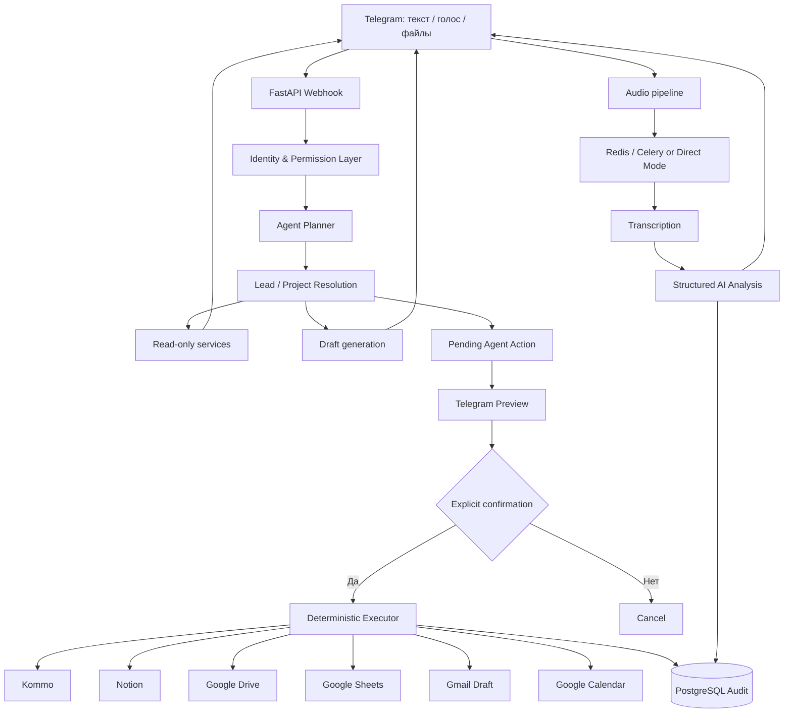

<div align="center">

# B&BS AI Operating System

### Telegram AI Agent для Buy & Bring Solutions

Единый рабочий интерфейс для обработки B2B-лидов, ведения проектов, анализа переговоров и управления следующими действиями.


</div>

---

## О проекте

**B&BS AI Agent** — это внутренний цифровой помощник Buy & Bring Solutions, работающий через Telegram.

Менеджер может писать или говорить обычными словами:

- «Что мне делать сегодня?»
- «Покажи проект 135»
- «Найди клиента с кормушками»
- «Сделай follow-up на польском»
- «Добавь примечание: клиент ждёт новую цену»
- «Поставь задачу перезвонить завтра в 10:00»
- «Проанализируй этот разговор»
- «Подготовь запрос китайскому производителю»

Агент находит нужную сделку, собирает контекст, подготавливает результат и — если требуется изменение внешней системы — обязательно показывает предварительный просмотр и запрашивает подтверждение.

> Главная цель проекта — собрать операционную работу компании в одной интеллектуальной среде, уменьшить ручную рутину, ускорить реакцию на клиентов и формировать долговременную корпоративную память.

---

## Основной принцип безопасности

Агент разделяет операции на три уровня:

| Уровень | Что происходит | Подтверждение |
|---|---|---|
| **Чтение** | Поиск сделки, карточка проекта, приоритеты, диагностика | Не требуется |
| **Подготовка** | Follow-up, письмо, КП, запрос поставщику, ТЗ | Не требуется, ничего не отправляется |
| **Внешняя запись** | Kommo, Notion, Drive, Gmail, Calendar, Sheets | Обязательный preview и подтверждение |

Рабочий контур любой внешней записи:

```text
proposal
→ validation
→ permission check
→ preview
→ explicit confirmation
→ deterministic executor
→ audit
```

### Неприкосновенные правила

- WhatsApp-сообщения не отправляются агентом автоматически.
- Gmail создаёт только черновики и не отправляет письма.
- Изменения Kommo, Notion, Drive, Calendar и Sheets требуют подтверждения.
- Внутренний номер B&BS, например `135`, не равен техническому Kommo ID.
- Маркетинговый статус Google Sheets в колонке `W` не копируется из этапа Kommo и не изменяется синхронизацией.
- Токены, private keys и credential JSON нельзя публиковать в Git, Telegram или логах.

---

## Что умеет агент

### Telegram как единый интерфейс

- текстовые и голосовые запросы обычным языком;
- главное меню и inline-кнопки;
- память активного проекта;
- уточнение неоднозначной сделки;
- работа по внутреннему номеру, имени, телефону, компании или товару;
- пакетные задачи и примечания для нескольких сделок;
- роли пользователей и ограничение доступа менеджера.

### Kommo CRM

- список и поиск открытых сделок;
- карточка сделки с контактом, бюджетом, этапом, задачами и примечаниями;
- поиск по внутреннему номеру B&BS;
- создание нового лида после preview;
- редактирование названия, бюджета и этапа;
- создание примечаний и задач;
- защита от повторных записей;
- повторная проверка ответственного менеджера перед записью;
- чтение доступного контекста внешних чатов Kommo.

### Голосовые сообщения

Менеджер может отправить запись после разговора с клиентом. Агент:

1. скачивает аудио;
2. выполняет транскрибацию;
3. выделяет подтверждённые факты;
4. определяет недостающие вопросы и риски;
5. предлагает следующий шаг;
6. формирует сообщение клиенту;
7. предлагает действия в Kommo, Calendar, Gmail или Notion.

Статус обработки доступен через `/jobs`.

### AI-черновики

Агент готовит:

- коммерческие предложения;
- follow-up сообщения;
- письма;
- запросы фабрикам и поставщикам;
- технические задания;
- структуры каталогов и прайс-листов.

Текст генерируется на языке клиента или на языке, указанном менеджером: `pl`, `uk`, `ru`, `en`, `de`, `zh`.

### WhatsApp

Поддерживаются два безопасных сценария.

**Исходящее сообщение:**

1. агент готовит текст;
2. пользователь может изменить текст или язык;
3. кнопка открывает WhatsApp с заполненным сообщением;
4. пользователь отправляет сообщение вручную;
5. отдельное подтверждение добавляет отметку в Kommo.

**Входящее сообщение через Meta webhook:**

- webhook проверяет подпись Meta, если задан `WHATSAPP_APP_SECRET`;
- входящий номер сопоставляется со сделкой Kommo;
- менеджер получает уведомление в Telegram;
- сообщение может быть записано в Kommo с защитой от дублей;
- доступны кнопки перехода в WhatsApp и Kommo.

Автоматическая отправка WhatsApp остаётся отключённой.

### Google Calendar

Calendar используется для действий с точным временем:

- звонок;
- Zoom;
- встреча;
- визит;
- выставка;
- поездка;
- демонстрация.

Перед созданием показываются дата, время, часовой пояс, длительность, напоминание и связанные действия. Обычный follow-up без точного времени создаётся как задача Kommo, а не событие Calendar.

### Gmail

- подготовка письма;
- определение адресата из контакта;
- preview;
- создание Gmail Draft после подтверждения.

Отправка письма не выполняется.

### Notion

- проекты;
- задачи;
- коммуникации;
- черновики КП и каталогов;
- синхронизация рабочих данных;
- диагностика структуры и прав доступа.

Недоступность Notion не должна блокировать чтение карточки Kommo.

### Google Drive

- создание проектной папки;
- стандартная структура подпапок;
- классификация файла;
- preview размещения;
- загрузка после подтверждения;
- связь файла с Kommo и Notion;
- диагностика API, прав, Shared Drive и folder ID.

### Google Sheets и подключение новых лидов

Таблица используется как маркетинговый реестр, а Kommo — как рабочая CRM.

Ручной onboarding обрабатывает строки, где колонка `Y` ещё пустая:

1. находит одну надёжно соответствующую сделку Kommo;
2. предлагает следующий внутренний номер B&BS;
3. предлагает название вида `166 - Товар`;
4. при необходимости переводит входящую сделку на этап «Первый контакт»;
5. подготавливает первичное примечание;
6. подготавливает квалификационную задачу;
7. выполняет изменения только после подтверждения.

При этом:

- колонка `W` не изменяется;
- ручной комментарий в `X` не изменяется;
- новая сделка Kommo этим flow не создаётся;
- неоднозначные совпадения пропускаются.

---

## Типовой рабочий день менеджера

### Утро

```text
/plan
/digest
/inbox
/overdue
```

Менеджер получает приоритеты, просроченные действия и сделки без следующего шага.

### После звонка

1. Открыть проект или нажать **🎙 Новый разговор**.
2. Отправить голосовое резюме.
3. Проверить факты, вопросы и риски.
4. Подготовить сообщение клиенту.
5. Создать примечание и следующую задачу.
6. Подтвердить только корректные действия.

### Перед завершением дня

```text
/evening
/without_next
/waiting_us
/waiting_client
```

Цель — не оставлять активные сделки без понятного владельца следующего действия и срока.

---

## Основные команды

| Команда | Назначение |
|---|---|
| `/agent` | Возможности AI-агента |
| `/menu` | Главное меню |
| `/digest` | Приоритетные сделки |
| `/plan` | План на сегодня |
| `/inbox` | Операционный inbox |
| `/overdue` | Просроченные действия |
| `/without_next` | Сделки без следующего шага |
| `/waiting_us` | Клиенты, которые ждут действий B&BS |
| `/waiting_client` | Сделки, где ожидается клиент |
| `/stale` | Проекты без свежей активности |
| `/jobs` | Статус обработки аудио |
| `/status_sync` | Preview onboarding лидов Sheets ↔ Kommo |
| `/sheets_sync_preview` | Аналитический preview Sheets |
| `/drive_status` | Диагностика Google Drive |
| `/integration_status` | Состояние интеграций |
| `/errors` | Последние ошибки |
| `/kommo_test` | Проверка Kommo |
| `/notion_test` | Проверка Notion |
| `/calendar_test` | Проверка Calendar |
| `/invite` | Одноразовое приглашение сотрудника |
| `/team` | Пользователи и роли |
| `/bind_kommo` | Привязка Telegram-пользователя к Kommo user ID |
| `/reset_memory` | Очистка активного контекста |

Команды не обязательны: большинство действий можно формулировать обычными словами.

---

## Примеры запросов

```text
Покажи проект 135
Что по Maciej Walasek?
Найди клиента по номеру +48 501 000 000
Покажи первый проект из дайджеста

Сделай follow-up по этой сделке на польском
Подготовь запрос поставщику по проекту 207
Сделай техническое задание по текущему проекту

Добавь примечание: клиент подтвердил тестовый заказ
Поставь задачу по 135 завтра в 10:00 — запросить новую цену
Запланируй созвон в пятницу в 15:00 на 30 минут

Проанализируй разговор и скажи, что я не спросил
Обнови проекты 134, 135 и 139 по моему голосовому сообщению
```

Для явного технического Kommo ID используйте `#123456` или `Kommo ID 123456`.

---

## Роли и доступ

| Роль | Возможности |
|---|---|
| **Owner** | Полный контроль, приглашения, управление командой |
| **Admin** | Администрирование и операционные действия |
| **Manager** | Работа только с разрешёнными или назначенными сделками |
| **Viewer** | Только чтение, без подготовки и подтверждения записей |

### Подключение менеджера

1. Owner отправляет `/invite`.
2. Выбирает роль **Manager**.
3. Передаёт одноразовую ссылку сотруднику.
4. Сотрудник открывает ссылку и нажимает **Start**.
5. Owner привязывает пользователя к Kommo:

```text
/bind_kommo TELEGRAM_ID KOMMO_USER_ID
```

До привязки Manager не получает доступ к клиентским сделкам. Это сделано специально: агент не угадывает личность сотрудника и владельца сделки.

---

## Архитектура



### Роли систем

| Система | Источник истины для |
|---|---|
| **Telegram** | Интерфейс, команды, preview и подтверждения |
| **Kommo** | Сделки, этапы, контакты, задачи, примечания, ответственные |
| **PostgreSQL** | Память агента, pending actions, аудит, роли, голосовые |
| **Notion** | Структурированный проектный контекст и рабочая база знаний |
| **Google Drive** | Оригиналы документов и проектные файлы |
| **Google Sheets** | Маркетинговый реестр и внутренняя нумерация лидов |
| **Google Calendar** | Действия с точным временем |
| **Gmail** | Черновики писем |
| **WhatsApp** | Ручная отправка и входящие webhook-уведомления |

---

## Быстрый запуск

### Требования

- Docker и Docker Compose;
- Telegram Bot Token;
- PostgreSQL;
- Redis;
- OpenAI API key;
- Kommo access token;
- HTTPS URL для webhook;
- credentials подключаемых Google/Notion сервисов.

### 1. Клонирование

```bash
git clone https://github.com/hilfikiri1/bot_lead.git
cd bot_lead
cp .env.example .env
```

Заполните `.env`. Не добавляйте файл с секретами в Git.

### 2. Локальный запуск

```bash
docker compose up --build -d
```

### 3. Миграции

```bash
docker compose exec api alembic upgrade head
docker compose exec api alembic current
```

### 4. Проверка

```bash
curl http://localhost:8000/health
curl http://localhost:8000/ready
curl http://localhost:8000/version
```

Swagger доступен по `/docs`, только если разрешён переменной `EXPOSE_API_DOCS=true`.

### 5. Telegram webhook

При заполненном `WEBHOOK_BASE_URL` webhook регистрируется при запуске. Для ручной регистрации:

```bash
curl -X POST "https://api.telegram.org/bot<TELEGRAM_BOT_TOKEN>/setWebhook" \
  -d "url=https://your-domain.com/webhook/telegram" \
  -d "secret_token=<TELEGRAM_WEBHOOK_SECRET>"
```

### 6. Первый Owner

Задайте:

```env
TELEGRAM_OWNER_USER_ID=123456789
ALLOWED_TELEGRAM_USER_IDS=123456789
```

После запуска проверьте `/team`. Не удаляйте bootstrap allowlist, пока Owner не появился в базе.

---

## Основные переменные окружения

Полный список находится в [`.env.example`](.env.example).

### Core

```env
APP_ENV=production
DATABASE_URL=
CELERY_BROKER_URL=
CELERY_RESULT_BACKEND=
OPENAI_API_KEY=
OPENAI_MODEL=gpt-4o-mini
OPENAI_WHISPER_MODEL=whisper-1
```

### Telegram

```env
TELEGRAM_BOT_TOKEN=
TELEGRAM_WEBHOOK_SECRET=
WEBHOOK_BASE_URL=
TELEGRAM_OWNER_USER_ID=
ALLOWED_TELEGRAM_USER_IDS=
TELEGRAM_BOT_USERNAME=
```

### Kommo

```env
KOMMO_BASE_URL=
KOMMO_ACCESS_TOKEN=
KOMMO_DEFAULT_PIPELINE_ID=
KOMMO_DEFAULT_STATUS_ID=
KOMMO_MENU_PIPELINE_ID=
KOMMO_INTERNAL_LEAD_NUMBER_FIELD_ID=
```

### AI Agent

```env
AGENT_ENABLED=true
AGENT_AUTO_VOICE_MODE=true
AGENT_DEFAULT_CLIENT_LANGUAGE=pl
AGENT_ACTION_TTL_MINUTES=30
AGENT_STALE_DAYS_DEFAULT=7
AGENT_SOURCE_TIMEOUT_SECONDS=8
MANAGER_TIMEZONE=Europe/Warsaw
```

### Google Sheets

```env
GOOGLE_SHEETS_SPREADSHEET_ID=
GOOGLE_SHEETS_WORKSHEET_NAME=FB
GOOGLE_SHEETS_STATUS_COLUMN=W
GOOGLE_SHEETS_COMMENT_COLUMN=X
GOOGLE_SHEETS_LEAD_NUMBER_COLUMN=Y
GOOGLE_SHEETS_WRITE_ENABLED=false
LEAD_STATUS_SYNC_ENABLED=false
```

Сначала используйте read-only preview. Включайте запись только после проверки сопоставлений и прав service account.

### WhatsApp webhook

```env
WHATSAPP_ENABLED=false
WHATSAPP_VERIFY_TOKEN=
WHATSAPP_APP_SECRET=
WHATSAPP_PHONE_NUMBER_ID=
WHATSAPP_ACCESS_TOKEN=
```

`WHATSAPP_ENABLED=false` не мешает ручному Click to Chat. Meta credentials нужны для Cloud API webhook и будущих API-функций.

---

## Production / Railway

Для production рекомендуется раздельно запускать:

- FastAPI service;
- Celery worker;
- PostgreSQL;
- Redis.

Перед включением записи во внешние системы:

1. проверить deployed commit;
2. применить актуальный Alembic head;
3. проверить `/version`, `/health` и `/ready`;
4. выполнить `/kommo_test`, `/notion_test`, `/drive_status` и `/calendar_test`;
5. оставить `GOOGLE_SHEETS_WRITE_ENABLED=false` до ручной приёмки;
6. проверить один тестовый проект;
7. только затем включать рабочие записи.

---

## Тесты

```bash
# В контейнере
docker compose exec api pytest -q

# Локально
python -m pip install -r requirements.txt
pytest -q

# Синтаксическая проверка
python -m compileall -q app migrations

# Проверка Alembic
alembic heads
alembic current
```

Unit/regression tests не заменяют smoke-тест реальных Railway variables и внешних API.

---

## Служебные endpoints

| Endpoint | Назначение |
|---|---|
| `GET /health` | Базовая доступность приложения |
| `GET /ready` | Проверка готовности зависимостей |
| `GET /version` | Версия развернутого приложения |
| `GET /docs` | Swagger, если разрешён |
| `POST /webhook/telegram` | Telegram webhook |
| `GET /webhook/whatsapp` | Проверка Meta webhook |
| `POST /webhook/whatsapp` | Входящие Meta WhatsApp events |
| `GET /admin/leads` | Список лидов, защищённый Admin API key |
| `GET /admin/leads/{id}` | Детали лида и связанные данные |

---

## Структура проекта

```text
bot_lead/
├── app/
│   ├── agent/                  # planner, memory, tools, actions, executor
│   ├── api/                    # Telegram, WhatsApp, admin, auth
│   ├── models/                 # SQLAlchemy models
│   ├── services/               # Kommo, Drive, Sheets, Notion, Gmail, Calendar
│   ├── tasks/                  # Celery tasks
│   ├── main.py                 # FastAPI application
│   ├── config.py               # Environment settings
│   ├── database.py             # PostgreSQL connection
│   └── celery_app.py           # Worker configuration
├── migrations/                 # Alembic migrations
├── tests/                      # Unit and regression tests
├── storage/                    # Local development storage
├── docker-compose.yml
├── Dockerfile
├── alembic.ini
├── requirements.txt
├── .env.example
└── README.md
```

---

## Текущий статус функций

| Область | Статус |
|---|---|
| Telegram text/voice interface | Рабочий основной контур |
| Kommo search/cards/tasks/notes | Реализовано |
| Roles and Manager restrictions | Реализовано |
| Gmail drafts | Реализовано, без отправки |
| Calendar preview and confirmation | Реализовано |
| Manual WhatsApp handoff | Реализовано |
| Incoming WhatsApp webhook notifications | Реализовано при корректной настройке Meta |
| Manual Sheets → Kommo onboarding | Реализовано с подтверждением |
| Unified project card | Реализовано, допускает частичные данные |
| Full project timeline | Частично подключено |
| Durable outbox and automatic retry | Фундамент, не полный сквозной flow |
| Undo external actions | Фундамент, не готово для обещания пользователю |
| Deep PDF/XLSX/DOCX/OCR intelligence | В разработке |
| Fully automatic unified project memory | Частично реализовано |

> Агент не является автономным сотрудником, который самостоятельно принимает решения и выполняет действия в фоне. Он работает по запросам менеджера, формирует предложения и выполняет внешние изменения только после подтверждения.

---

## Безопасность

- Telegram webhook проверяется секретным токеном.
- Meta webhook может проверяться через `X-Hub-Signature-256`.
- Одноразовые приглашения хранятся в виде SHA-256 hash и имеют срок действия.
- Manager не должен читать чужие сделки при assigned-only scope.
- Viewer не может подтверждать внешние записи.
- Повторные callback и delivery markers защищают от дублей.
- Все внешние действия должны оставлять audit trail.
- Admin API защищается отдельным ключом.
- Секреты хранятся только в environment variables.

---

## Полезные документы

- [`AGENT_V3.md`](AGENT_V3.md) — единый агентный контур;
- [`AGENT_V4_IDENTITY_LANGUAGE_WHATSAPP.md`](AGENT_V4_IDENTITY_LANGUAGE_WHATSAPP.md) — роли, языки и WhatsApp handoff;
- [`STATUS_SYNC_SETUP.md`](STATUS_SYNC_SETUP.md) — Google Sheets и внутренняя нумерация;
- [`AGENT_V4_3_MARKETING_LEAD_SYNC.md`](AGENT_V4_3_MARKETING_LEAD_SYNC.md) — контракт безопасной синхронизации;
- [`PHASE1_RELEASE_NOTES.md`](PHASE1_RELEASE_NOTES.md) и [`PHASE2_RELEASE_NOTES.md`](PHASE2_RELEASE_NOTES.md) — история развития.

---

## Подход к разработке

Изменения должны выполняться небольшими проверяемыми PR:

1. прочитать актуальный `origin/main`;
2. не дублировать существующие интеграционные клиенты;
3. добавить или обновить regression tests;
4. сохранить preview → confirm → execute → audit;
5. не включать автоматическую отправку сообщений;
6. провести smoke-тест на безопасной тестовой сущности;
7. только после этого включать production writes.

---

<div align="center">

**Buy & Bring Solutions**  
B2B sourcing, supplier verification and full-cycle procurement from China.

</div>
