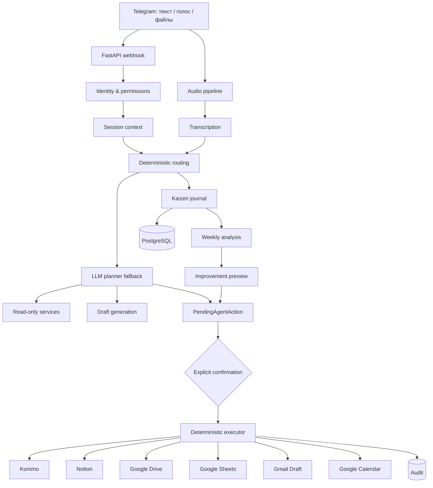

<div align="center">

# B&BS AI Operating System

### Telegram AI Agent для Buy & Bring Solutions

Единый рабочий интерфейс для B2B-лидов, проектов, переговоров, документов, следующих действий и постепенного улучшения бизнес-процессов.


</div>

---

## О проекте

**B&BS AI Agent** — внутренний цифровой помощник Buy & Bring Solutions, работающий через Telegram.

Менеджер может писать или говорить обычными словами:

- «Что горит?»
- «Покажи проект 135»
- «Что по нему?»
- «Найди клиента с кормушками»
- «Сделай follow-up на польском»
- «Добавь примечание: клиент ждёт новую цену»
- «Поставь задачу перезвонить завтра в 10:00»
- «Подготовь запрос китайскому производителю»
- «Подведём итоги дня»
- «Что ты понял за эту неделю?»

Агент находит нужную сделку, собирает контекст, подготавливает результат и — когда требуется изменение внешней системы — показывает preview и запрашивает подтверждение.

> Главная цель — объединить операционную работу компании, уменьшить повторный ручной поиск, ускорить реакцию на клиентов и формировать долговременную корпоративную память.

---

## Основной принцип безопасности

Агент разделяет операции на три уровня:

| Уровень | Что происходит | Подтверждение |
|---|---|---|
| **Чтение** | Поиск сделки, карточка проекта, приоритеты, диагностика, дневник | Не требуется |
| **Подготовка** | Follow-up, письмо, КП, запрос поставщику, ТЗ, недельные выводы | Ничего не отправляется |
| **Внешняя запись** | Kommo, Notion, Drive, Gmail, Calendar, Sheets | Обязательный preview и подтверждение |

Контур внешней записи:

```text
proposal
→ validation
→ permission check
→ preview
→ explicit confirmation
→ deterministic executor
→ audit
```

### Неприкосновенные правила

- WhatsApp не отправляется автоматически.
- Gmail создаёт только черновики.
- Kommo, Notion, Drive, Calendar и Sheets изменяются только после подтверждения.
- Внутренний номер B&BS, например `135`, не равен техническому Kommo ID.
- Маркетинговый статус Sheets в колонке `W` независим от этапа Kommo.
- Дневниковое голосовое не создаёт клиента, лид или запись в Kommo.
- Ежедневные мысли не отправляются в Notion.
- Notion получает только подтверждённые недельные карточки улучшений.
- Токены, private keys и credential JSON не публикуются в Git, Telegram или логах.

---

## Что умеет агент

### Telegram и контекст

- текстовые и голосовые запросы обычным языком;
- главное меню и inline-кнопки;
- память активного проекта;
- разрешение коротких фраз через текущий контекст;
- уточнение неоднозначной сделки;
- поиск по внутреннему номеру, имени, телефону, компании или товару;
- пакетные задачи и примечания;
- роли и ограничение доступа менеджера.

Короткие команды обрабатываются детерминированно до LLM planner:

```text
что горит
что срочно
план дня
без шага
ждут нас
мы ждём
зависшие
проект 135
что по нему
история
```

### Kommo CRM

- список и поиск открытых сделок;
- единая карточка сделки/проекта;
- контакты, бюджет, этап, задачи и примечания;
- поиск по внутреннему номеру B&BS;
- создание нового лида только после preview;
- редактирование названия, бюджета и этапа;
- создание примечаний и задач;
- защита от повторных записей;
- проверка ответственного менеджера;
- чтение доступного контекста внешних чатов.

### Голосовые сообщения

Один существующий pipeline используется для клиентских разговоров, команд и личной вечерней рефлексии:

```text
Telegram audio
→ download
→ transcription
→ agent_service.handle_message
→ либо агентная команда/дневник
→ либо анализ клиентского разговора
```

При активной вечерней рефлексии transcript сначала сохраняется как дневник и возвращает `handled=True`. Поэтому клиентский анализ и создание лида не запускаются.

Статус обычной обработки аудио доступен через `/jobs`.

### AI-черновики

Агент готовит:

- коммерческие предложения;
- follow-up сообщения;
- письма;
- запросы фабрикам и поставщикам;
- технические задания;
- структуры каталогов и прайс-листов.

Язык результата берётся из профиля клиента или задаётся менеджером: `pl`, `uk`, `ru`, `en`, `de`, `zh`.

### WhatsApp

Поддерживаются безопасные сценарии:

- ручной Click to Chat с подготовленным текстом;
- WhatsApp Cloud API inbox/outbox при корректной настройке Meta;
- проверка webhook-подписи;
- сопоставление входящего номера со сделкой Kommo;
- статусы `sent`, `delivered`, `read`, `failed`;
- 24-часовое окно свободного текста;
- явное подтверждение менеджера перед отправкой.

### Google Calendar

Calendar используется для точных событий: звонок, Zoom, встреча, визит, выставка, поездка, демонстрация. Перед созданием показываются дата, время, часовой пояс, длительность и напоминание.

Обычный follow-up без точного времени создаётся как задача Kommo.

### Gmail

- подготовка письма;
- определение адресата;
- preview;
- Gmail Draft после подтверждения;
- отправка письма не выполняется.

### Notion

- проекты;
- задачи;
- коммуникации;
- черновики КП и каталогов;
- подтверждённые карточки Kaizen Improvement;
- диагностика структуры и прав.

Недоступность Notion не блокирует чтение Kommo, локальный дневник или недельный отчёт.

### Google Drive

- проектные папки по странам;
- стандартные подпапки;
- классификация файлов;
- preview размещения;
- загрузка после подтверждения;
- связь файла с Kommo и Notion;
- диагностика прав, My Drive/Shared Drive и квоты service account.

### Google Sheets

Sheets используется как маркетинговый реестр, Kommo — как рабочая CRM.

Ручной onboarding:

1. находит надёжную пару Sheets ↔ Kommo;
2. присваивает внутренний номер в `Y`;
3. предлагает название `166 - Товар`;
4. подготавливает первичное примечание и задачу;
5. выполняет записи только после подтверждения.

При этом колонка `W` не изменяется. Отдельная `/comment_sync` обновляет только комментарий `X` после preview и повторной проверки.

---

## Личный Kaizen Journal

Дневник предназначен для владельца компании. Это не KPI, не контроль сотрудников и не трекер настроения.

### Итоги дня

```text
/evening
```

Также распознаются:

```text
Подведём итоги дня
Хочу рассказать, как прошёл день
Запиши итоги дня
Дополни дневник: ...
```

Бот предлагает рассказать одним текстом или голосом:

- что получилось;
- что мешало;
- где потерялось время;
- какие появились выводы и идеи;
- что важно завтра.

Сначала raw text/transcript сохраняется в PostgreSQL, затем OpenAI структурирует запись. При сбое AI исходная запись не теряется.

Ожидание ответа хранится в `AgentSession.context`, действует до шести часов и не переходит на следующий локальный день. Slash-команды не записываются в дневник.

### Итоги недели

```text
/week
```

Агент собирает записи с понедельника по воскресенье, ищет повторяющиеся факты и предлагает максимум три конкретных изменения процесса.

Правила:

- повторяемость требует минимум двух разных дней;
- при менее чем трёх заполненных днях выводы помечаются как предварительные;
- Kommo operational inbox добавляется read-only и best-effort;
- ошибка Kommo не блокирует отчёт;
- Notion-карточки не создаются автоматически.

Подтверждённые улучшения создаются в существующей Tasks database как `Type=Improvement`, `Source=Kaizen`. Полный контракт: [`KAIZEN_JOURNAL.md`](KAIZEN_JOURNAL.md).

---

## Типовой рабочий день

### Утро

```text
/plan
/digest
/inbox
/overdue
```

### После звонка

1. Открыть проект.
2. Отправить голосовое резюме.
3. Проверить факты, риски и вопросы.
4. Подготовить сообщение клиенту.
5. Создать примечание и следующую задачу.
6. Подтвердить только корректные действия.

### Перед завершением дня

```text
/without_next
/waiting_us
/waiting_client
/evening
```

### В конце недели

```text
/week
```

---

## Основные команды

| Команда | Назначение |
|---|---|
| `/agent` | Возможности AI-агента |
| `/menu` | Главное меню |
| `/today`, `/plan` | План на сегодня |
| `/digest` | Приоритетные сделки |
| `/inbox` | Операционный inbox |
| `/overdue` | Просроченные действия |
| `/without_next` | Сделки без следующего шага |
| `/waiting_us` | Клиенты ждут B&BS |
| `/waiting_client` | B&BS ждёт клиента |
| `/stale` | Проекты без свежей активности |
| `/evening` | Вечерняя рефлексия |
| `/week` | Недельный Kaizen-анализ |
| `/jobs` | Статус аудио |
| `/status_sync` | Onboarding Sheets ↔ Kommo |
| `/comment_sync` | Preview обновления комментариев X |
| `/drive_status` | Диагностика Google Drive |
| `/diag` | Полный read-only диагностический пакет |
| `/integration_status` | Состояние интеграций |
| `/errors` | Последние ошибки |
| `/kommo_test` | Проверка Kommo |
| `/notion_test` | Проверка Notion |
| `/calendar_test` | Проверка Calendar |
| `/invite` | Пригласить сотрудника |
| `/team` | Пользователи и роли |
| `/bind_kommo` | Привязать Telegram к Kommo user ID |
| `/reset_memory` | Очистить активный контекст |

Команды не обязательны: большинство действий можно формулировать обычными словами.

---

## Роли и доступ

| Роль | Возможности |
|---|---|
| **Owner** | Полный контроль, приглашения, управление командой |
| **Admin** | Администрирование и операционные действия |
| **Manager** | Работа с разрешёнными или назначенными сделками |
| **Viewer** | Только чтение, без подтверждения записей |

Manager должен быть привязан к Kommo user ID:

```text
/bind_kommo TELEGRAM_ID KOMMO_USER_ID
```

---

## Архитектура



### Роли систем

| Система | Источник истины для |
|---|---|
| **Telegram** | Интерфейс, команды, preview и подтверждения |
| **Kommo** | Сделки, этапы, контакты, задачи, примечания |
| **PostgreSQL** | Память, pending actions, аудит, роли, дневник |
| **Notion** | Проектный контекст и подтверждённые improvement cards |
| **Google Drive** | Оригиналы документов и проектные файлы |
| **Google Sheets** | Маркетинговый реестр и внутренняя нумерация |
| **Google Calendar** | Действия с точным временем |
| **Gmail** | Черновики писем |
| **WhatsApp** | Ручная/API-отправка и входящие события |

---

## Быстрый запуск

### Требования

- Docker и Docker Compose;
- Telegram Bot Token;
- PostgreSQL;
- Redis;
- OpenAI API key;
- Kommo access token;
- HTTPS URL для webhook;
- credentials подключаемых Google/Notion сервисов.

```bash
git clone https://github.com/hilfikiri1/bot_lead.git
cd bot_lead
cp .env.example .env
docker compose up --build -d
docker compose exec api alembic upgrade head
```

Проверка:

```bash
curl http://localhost:8000/health
curl http://localhost:8000/ready
curl http://localhost:8000/version
```

Swagger доступен по `/docs`, только при `EXPOSE_API_DOCS=true` вне production.

---

## Основные переменные окружения

Полный список: [`.env.example`](.env.example).

```env
APP_ENV=production
DATABASE_URL=
REDISHOST=
REDISPORT=6379
TELEGRAM_BOT_TOKEN=
TELEGRAM_WEBHOOK_SECRET=
WEBHOOK_BASE_URL=
TELEGRAM_OWNER_USER_ID=
ALLOWED_TELEGRAM_USER_IDS=
OPENAI_API_KEY=
OPENAI_MODEL=gpt-4o-mini
OPENAI_WHISPER_MODEL=whisper-1
KOMMO_BASE_URL=
KOMMO_ACCESS_TOKEN=
MANAGER_TIMEZONE=Europe/Warsaw
```

### Kaizen scheduler

```env
AGENT_EVENING_REFLECTION_ENABLED=false
AGENT_EVENING_REFLECTION_HOUR=19
AGENT_EVENING_REFLECTION_REMINDER_HOURS=1
AGENT_WEEKLY_REVIEW_ENABLED=false
AGENT_WEEKLY_REVIEW_WEEKDAY=6
AGENT_WEEKLY_REVIEW_HOUR=19
AGENT_WEEKLY_REVIEW_MIN_DAILY_ENTRIES=2
AGENT_DIGEST_TIMEZONE=Europe/Warsaw
```

`0 = Monday`, `6 = Sunday`. При включённой reflection обычный evening digest не дублируется. Morning digest не меняется.

---

## Production / Railway

1. Merge только после зелёного CI.
2. Сделать backup PostgreSQL.
3. Deploy с kaizen flags `false`.
4. Применить `alembic upgrade head`.
5. Проверить единственный head `014_kaizen_journal_entries`.
6. Проверить `/health`, `/ready`, `/version`, `/diag`.
7. Выполнить ручной text/voice smoke `/evening`.
8. Только затем включить evening reflection.
9. После нескольких записей включить weekly review.

Полный порядок: [`RAILWAY_AGENT_V5.md`](RAILWAY_AGENT_V5.md).

---

## Тесты

```bash
python -m pip install -r requirements.txt
python -m compileall -q app migrations
alembic heads
pytest -q
```

Unit/regression tests не заменяют smoke-тест реальных Railway variables и внешних API.

---

## Служебные endpoints

| Endpoint | Назначение |
|---|---|
| `GET /health` | Базовая доступность |
| `GET /ready` | Готовность сервиса |
| `GET /version` | Версия приложения |
| `GET /docs` | Swagger, если разрешён |
| `POST /webhook/telegram` | Telegram webhook |
| `GET/POST /webhook/whatsapp` | Meta webhook |
| `GET /admin/diagnostics/run` | Защищённая диагностика |

---

## Текущий статус

| Область | Статус |
|---|---|
| Telegram text/voice | Основной рабочий контур |
| Kommo search/cards/tasks/notes | Реализовано |
| Roles and Manager restrictions | Реализовано |
| Gmail drafts | Реализовано, без отправки |
| Calendar preview/confirmation | Реализовано |
| WhatsApp Cloud inbox/outbox | Реализовано при настройке Meta |
| Sheets onboarding/comments | Реализовано с подтверждением |
| Unified project card/timeline | Реализовано, часть источников best-effort |
| Drive project files | Реализовано, зависит от корректного auth mode |
| Kaizen daily/weekly journal | Local-first, Notion only after confirmation |
| Durable outbox/retry | Фундамент, не весь сквозной flow |
| Deep PDF/XLSX/DOCX/OCR | В развитии |

> Агент не является автономным сотрудником. Он анализирует, предлагает и выполняет внешние изменения только после подтверждения менеджера.

---

## Полезные документы

- [`AGENT_V5_OPERATIONS.md`](AGENT_V5_OPERATIONS.md) — операционный директор;
- [`KAIZEN_JOURNAL.md`](KAIZEN_JOURNAL.md) — дневник, weekly review и Notion Board;
- [`RAILWAY_AGENT_V5.md`](RAILWAY_AGENT_V5.md) — production rollout;
- [`AGENT_V4_IDENTITY_LANGUAGE_WHATSAPP.md`](AGENT_V4_IDENTITY_LANGUAGE_WHATSAPP.md) — роли, языки и WhatsApp;
- [`STATUS_SYNC_SETUP.md`](STATUS_SYNC_SETUP.md) — Sheets и внутренняя нумерация;
- [`SYSTEM_DIAGNOSTICS.md`](SYSTEM_DIAGNOSTICS.md) — единый диагностический пакет.

---

## Подход к разработке

1. Читать актуальный `origin/main`.
2. Не дублировать клиентов OpenAI, Telegram, Notion или PostgreSQL.
3. Делать небольшие проверяемые изменения.
4. Добавлять regression tests.
5. Сохранять preview → confirm → execute → audit.
6. Не включать автоматическую отправку клиентам.
7. Проводить production smoke на безопасной сущности.
8. Не merge и не deploy без явного решения владельца.

---

<div align="center">

**Buy & Bring Solutions**  
B2B sourcing, supplier verification and full-cycle procurement from China.

</div>
